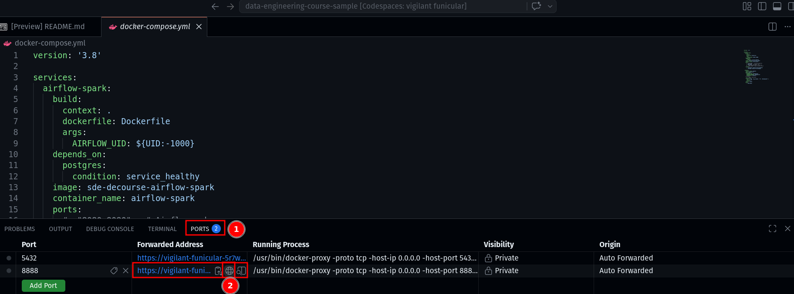
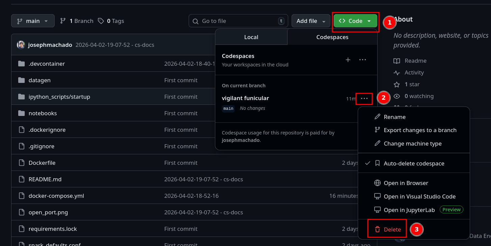

Code for [Airflow 3.0 Tutorial](https://www.startdataengineering.com/post/airflow-tutorial/)
<!---->
<!-- [](https://codespaces.new/josephmachado/airflow-tutorial) -->
<!---->
<!-- In GitHub Codespaces wait a few minutes, the `docker compose up -d --build` command will run automatically. -->
<!---->
<!-- After which wait another 2 minutes and then click on the `ports` tab and the `world` icon next to link with port 8888 to open jupyterlab in your browser. -->
<!---->
<!--  -->
<!---->
<!-- Once you are done delete the codespace instance as shown below. -->
<!---->
<!--  -->
<!---->

## Local Setup 

**Prerequisites**

1. [Docker version >= 20.10.17](https://docs.docker.com/engine/install/) and [Docker compose v2 version >= v2.10.2](https://docs.docker.com/compose/#compose-v2-and-the-new-docker-compose-command).

**Windows users**: Please use WSL and Install Ubuntu using this [document](https://documentation.ubuntu.com/wsl/stable/howto/install-ubuntu-wsl2/#). In your ubuntu terminal install the prerequisites above.

Clone and start the container as shown below: 

```bash
git clone https://github.com/josephmachado/airflow-tutorial.git
cd airflow-tutorial
docker compose up -d --build
sleep 30 # wait 30 seconds for Airflow & Jupyter Notebook to start
```

Open Airflow at [http://localhost:8080](http://localhost:8080)

Open JupyterLab at [http://localhost:8888](http://localhost:8888)

Stop containers after you are done with `docker compose down -v`.

